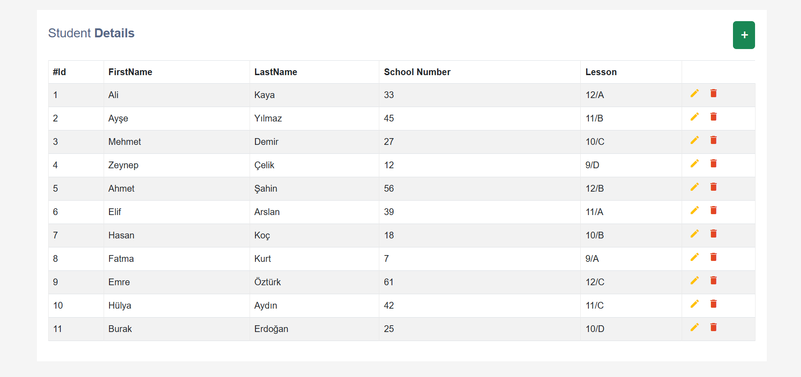
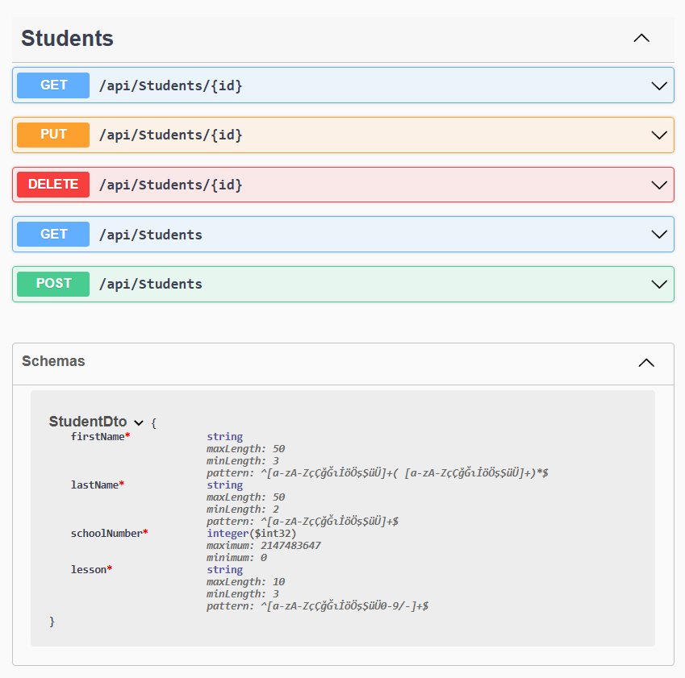
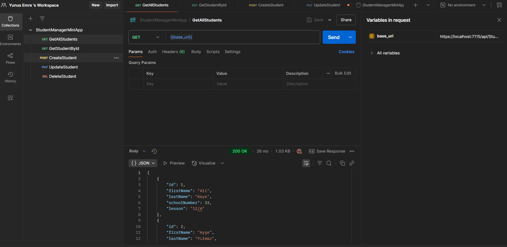

# 🎓 Öğrenci Yönetim Sistemi
Merhaba, ben Yunus Emre. Projem, frontend ve backend içeren basit bir öğrenci yönetim sistemi. CRUD işlemleri yapılabiliyor.
Kod yazarken öğrenmek, pratik yapmak ve küçük bir sistem geliştirmek istedim.
Swagger ve Postman'la test süreci daha rahat hale geldi.
Frontend tarafı da basit HTML/JS/Bootstrap ile çalışıyor.

## 📌 Özellikler

- ✅ Swagger ile detaylı API dokümantasyonu  
- ✅ Postman koleksiyonu ile kolay test imkanı  
- ✅ Basit ve kullanıcı dostu frontend arayüzü  
## Kurulum ve Kullanım Talimatları

### 1. 🚀 Depoyu Klonla
   git clone https://github.com/kullaniciAdi/OgrenciYonetimSistemi.git`

### 2. 🖥️ Backend API’yi Çalıştır
Backend servislerini kullanabilmek için, frontend tarafındaki StudentRequest.js dosyasındaki baseUrl'yi kendi ortamınıza göre ayarlayın:

  const baseUrl = "https://localhost:{PORT}/api/";
  {PORT} kısmını backend’in çalıştığı porta göre güncelleyin.

Ayrıca Postman koleksiyonunda kullanılan {{base_url}} ortam değişkenini de aynı şekilde ayarlamalısınız:

  base_url = https://localhost:{PORT}/api/Students

### 3. Frontend’i Çalıştır
Projede frontend tarafı için bir index.html dosyası bulunmaktadır.
Aşağıdaki adımlarla tarayıcıdan arayüzü açabilirsiniz:

- index.html dosyasını çift tıklayarak açın
- Ya da bir canlı sunucu ile (örneğin Live Server) tarayıcıda çalıştırın
- Öğrenci ekleme, düzenleme, silme ve listeleme işlemlerini görsel arayüz üzerinden gerçekleştirin

## Dökümantasyon

### 1. Swagger Dokümantasyonu
Proje içinde API uç noktaları Swagger ile belgelenmiştir.
Api'yi çalıştırdaktan sonra Tarayıcıdan https://localhost:{PORT}/swagger adresine giderek Swagger arayüzüne ulaşabilirsiniz.

Desteklenen işlemler:

- GET    /api/Students           → Tüm öğrencileri getirir
- GET    /api/Students/{id}      → Belirli bir öğrenciyi getirir
- POST   /api/Students           → Yeni öğrenci ekler
- PUT    /api/Students/{id}      → Öğrenciyi günceller
- DELETE /api/Students/{id}      → Öğrenciyi siler

### 2. Postman Koleksiyonu
Postman ile API'yi manuel test edebilirsiniz.
Projeyle birlikte aşağıdaki istekler koleksiyon halinde sağlanır:

- GET    → GetAllStudents     → Tüm öğrencileri getirir
- GET    → GetStudentById     → Belirli bir öğrenciyi getirir
- POST   → CreateStudent      → Yeni öğrenci ekler
- PUT    → UpdateStudent      → Öğrenciyi günceller
- DELETE → DeleteStudent      → Öğrenciyi siler

